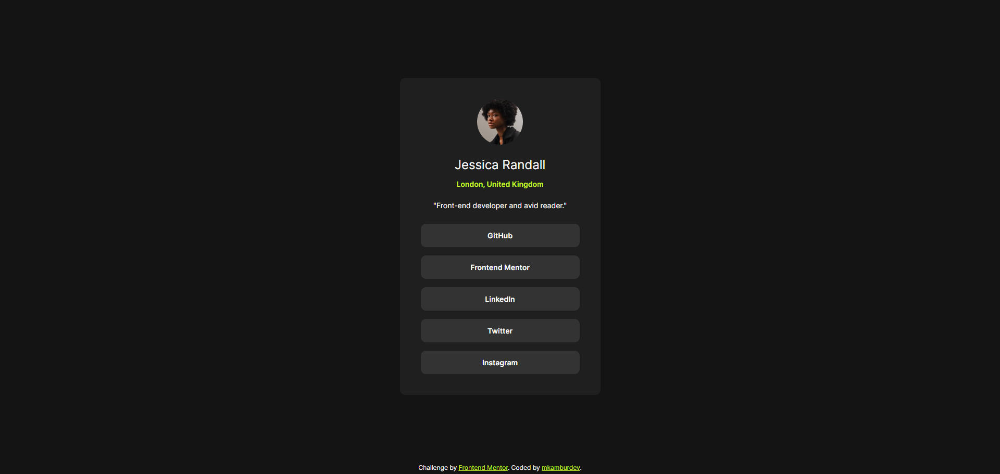

# Frontend Mentor - Social links profile solution

This is a solution to the [Social links profile challenge on Frontend Mentor](https://www.frontendmentor.io/challenges/social-links-profile-UG32l9m6dQ). Frontend Mentor challenges help you improve your coding skills by building realistic projects. 

## Table of contents

- [Frontend Mentor - Social links profile solution](#frontend-mentor---social-links-profile-solution)
	- [Table of contents](#table-of-contents)
	- [Overview](#overview)
		- [The challenge](#the-challenge)
		- [Screenshot](#screenshot)
		- [Links](#links)
	- [My process](#my-process)
		- [Built with](#built-with)
		- [What I learned](#what-i-learned)
	- [Author](#author)

## Overview

### The challenge

Users should be able to:

- See hover and focus states for all interactive elements on the page

### Screenshot

### Links

- Solution URL: [URL here]()
- Live Site URL: [URL here]()

## My process

### Built with

- Semantic HTML5 markup
- SCSS
- Flexbox
- Mobile-first workflow

### What I learned

While working on this SCSS project, I gained practical experience in fundamental SCSS concepts. I learned to use variables to control values such as colors and fonts from a centralized location. Additionally, I practiced responsive design using media queries and modern layout techniques like flexbox. By modularizing the project files, I learned to create a more modular structure and improve code management for larger-scale projects.

## Author

- Website - [bento.me/mkambur](https://bento.me/mkambur)
- Frontend Mentor - [@mkamburdev](https://www.frontendmentor.io/profile/mkamburdev)
- Twitter - [@mkambur_](https://www.twitter.com/mkambur_)